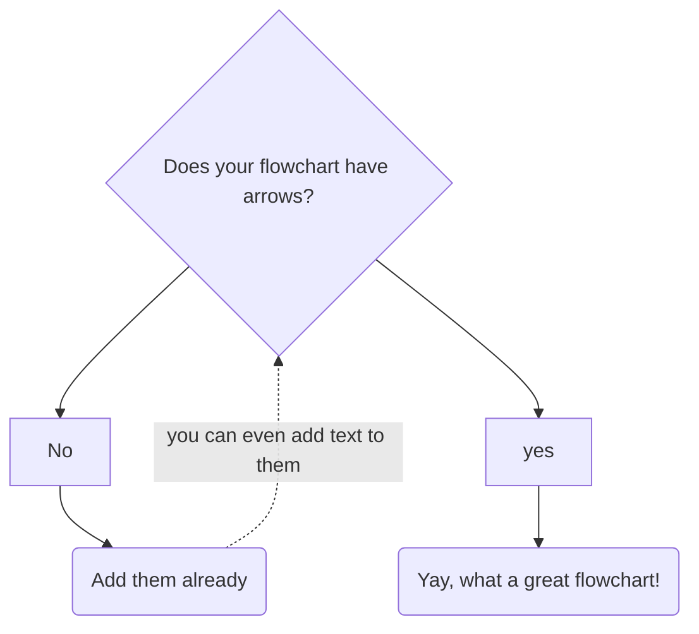
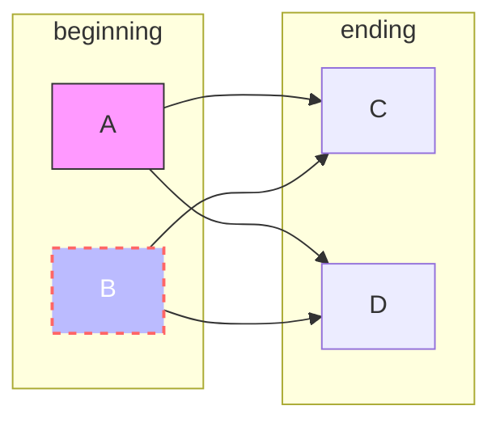

# Title 1

## Title 2

### Title 3

#### Title 4

##### Title 5

###### Title 6

Si asta spune cel ce spune:

> Citat din creanga. Oare cum e sa citezi as de talentat

```mermaid
  graph TD;
      A-->B;
      A-->C;
      B-->D;
      C-->D;
```

```mermaid
graph TD
    A{Does your flowchart have arrows?} --> B[No]
    A --> C[yes]
    B --> D(Add them already)
    C --> E(Yay, what a great flowchart!)
    D -.->|you can even add text to them| A
```

```mermaid
graph LR

A & B--> C & D
style A fill:#f9f,stroke:#333,stroke-width:px
style B fill:#bbf,stroke:#f66,stroke-width:2px,color:#fff,stroke-dasharray: 5 5

subgraph beginning
A & B
end

subgraph ending
C & D
end
```

```mermaid
gantt
title Writing my thesis
dateFormat  MM-DD
axisFormat  %m-%d
section Research
Procrastinate           :a1, 01-01, 59d
Do it     :after a1  , 10d
section Write-up
Should I start?     :03-01 , 20d
Ugh ok      : 6d
```
